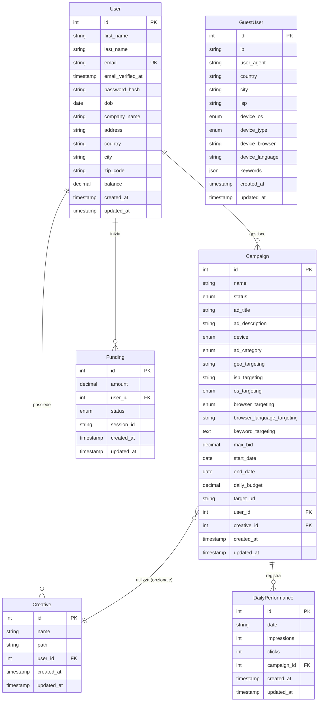

# **Documentazione di CuneoPubblicità**

## **Struttura del Database (Descrizione Entità-Relazione)**

Di seguito è riportato il diagramma Entità-Relazione (ERD) che descrive la struttura del database:

Il database è composto dalle seguenti entità principali con le loro relazioni, come definite nelle migration:

* **USERS (Utenti):** Memorizza le informazioni degli inserzionisti registrati.  
  * **Attributi Chiave:** id (PK), first\_name, last\_name, email (Univoca), password (Hashed), dob, company\_name, address, country, city, zip\_code, balance (decimal 10,2), email\_verified\_at (nullable), remember\_token, two\_factor\_recovery\_codes, two\_factor\_secret, profile\_photo\_url (attributo appeso).  
  * **Relazioni:**  
    * Un User (id) hasMany Creatives (user\_id).  
    * Un User (id) hasMany Campaigns (user\_id).  
    * Un User (id) hasMany Fundings (user\_id).  
* **GUEST\_USERS (Utenti Ospiti):** Traccia informazioni anonime sui visitatori che interagiscono con gli annunci.  
  * **Attributi Chiave:** id (PK), ip, user\_agent (default 'unknown'), country (default 'unknown'), city (default 'unknown'), isp (default 'unknown'), device\_os (enum: 'Windows', 'Linux', 'Android', 'iOS', 'unknown', default 'unknown'), device\_type (enum: 'desktop', 'mobile', 'unknown', default 'unknown'), device\_browser (default 'unknown'), device\_language (default 'unknown'), keywords (jsonb, default '\[\]').  
  * L'arricchimento dei dati IP è facilitato dalla libreria ipinfo/ipinfo e Laravel\\Jetstream\\Agent.  
* **CREATIVES (Creatività):** Rappresenta gli asset grafici (immagini) utilizzati nelle campagne.  
  * **Attributi Chiave:** id (PK), name, path (percorso del file su S3), user\\\_id (FK a USERS, onDelete('cascade')).  
  * **Relazioni:**  
    * Appartiene a un User (user\_id belongsTo).  
    * Può essere utilizzata (opzionalmente) da una o più Campaigns (Campaigns belongsTo Creative tramite creative\_id).  
  * La gestione e manipolazione delle immagini (es. upload a S3) è supportata dalla libreria intervention/image (dedotto dalle dependencies) e dalla gestione storage di Laravel (Storage::disk('s3')). Il modello include un accessor getUrl() per generare l'URL pubblico dell'immagine su S3.  
* **CAMPAIGNS (Campagne):** Contiene i dettagli delle campagne pubblicitarie create dagli utenti.  
  * **Attributi Chiave:** id (PK), name, status (enum: 'active', 'paused', 'deleted', default 'paused'), ad\_title, ad\_description, device (enum: 'all', 'desktop', 'mobile'), ad\_category (enum: 'ristoranti', 'tecnologia', ..., 'altro'), geo\_targeting (nullable), isp\_targeting (nullable), os\_targeting (enum: 'android', ..., 'all'), browser\_targeting (enum: 'chrome', ..., 'all'), browser\_language\_targeting (nullable), keyword\_targeting (text, nullable, castato a array), max\_bid (decimal 10,2), start\_date (date), end\_date (date), daily\_budget (decimal 10,2, nullable), target\_url, user\\\_id (FK a USERS, onDelete('cascade')), creative\\\_id (FK a CREATIVES, nullable, onDelete('setnull')).  
  * **Relazioni:**  
    * Appartiene a un User (user\_id belongsTo).  
    * Può utilizzare (opzionalmente) una Creative (creative\_id belongsTo).  
    * Registra molte DailyPerformance (hasMany).  
* **DAILY\_PERFORMANCE (Performance Giornaliere):** Memorizza le statistiche giornaliere di ogni campagna.  
  * **Attributi Chiave:** id (PK), date (string), impressions (integer), clicks (integer), cost (assente nella migration/modello fornito, ma calcolato nei controller), campaign\\\_id (FK a CAMPAIGNS, onDelete('cascade')).  
  * **Indici:** (campaign\_id, impressions, clicks).  
  * **Relazioni:**  
    * Appartiene a una Campaign (campaign\_id belongsTo).  
* **FUNDINGS (Finanziamenti):** Registra le transazioni di finanziamento degli account utente.  
  * **Attributi Chiave:** id (PK), amount (decimal 10,2), user\\\_id (FK a USERS, onDelete('cascade')), status (enum: 'unpaid', 'paid', 'failed', default 'unpaid'), session\\\_id (nullable).  
  * **Relazioni:**  
    * Appartiene a un User (user\_id belongsTo).  
  * Le transazioni di pagamento sono gestite tramite l'integrazione con stripe/stripe-php.

## **Documentazione C4**

### **Livello 1: Contesto del Sistema (System Context)**

Il "Sistema di Gestione Campagne Pubblicitarie Laravel" opera all'interno di un ecosistema che include diversi attori e sistemi esterni.

**Descrizione degli Elementi di Contesto:**

* **Utente Inserzionista (Advertiser):** L'attore principale. È una persona o un'azienda che si registra sulla piattaforma (gestita tramite Jetstream) per creare, finanziare, gestire e monitorare le proprie campagne pubblicitarie. Interagisce con il sistema principalmente tramite un'interfaccia web fornita dall'applicazione Laravel/Livewire, utilizzando il protocollo HTTPS.  
* **Sistema di Gestione Campagne Pubblicitarie Laravel (Questo Sistema):** È l'applicazione software al centro di questa documentazione, costruita utilizzando il framework Laravel 12.x con PHP 8.2+. Le sue responsabilità principali includono fornire l'interfaccia agli inserzionisti e agli utenti visitatori, gestire la logica di business delle campagne (targeting, erogazione, statistiche), l'autenticazione/autorizzazione, e orchestrare le interazioni con il database e i servizi esterni.  
* **Utente Visitatore (Guest User):** L'utente finale che visualizza gli annunci pubblicitari erogati dalla piattaforma su vari siti o applicazioni. Il sistema traccia e arricchisce informazioni anonime su questi utenti (IP, user agent, dispositivo, geolocalizzazione, ISP, lingua) usando la libreria ipinfo/ipinfo e Laravel\\Jetstream\\Agent, memorizzandole nell'entità GuestUser. L'interazione avviene tramite protocollo HTTP/HTTPS per l'erogazione degli annunci.  
* **Sistema di Pagamento Esterno (Stripe):** Un servizio di terze parti (stripe/stripe-php) che gestisce in modo sicuro le transazioni finanziarie. L'applicazione Laravel interagisce con l'API di Stripe (tipicamente HTTPS/JSON) per creare sessioni di checkout e gestire i webhook di conferma pagamento.  
* **Google Places API (Servizio Esterno SaaS):** Un servizio fornito da Google, utilizzato dall'applicazione per funzionalità di geolocalizzazione, come l'autocompletamento degli indirizzi per il targeting geografico (interazione tramite API HTTPS/JSON).  
* **AWS S3 (Servizio di Cloud Storage):** Un servizio di storage di oggetti fornito da Amazon Web Services (aws/aws-sdk-php, league/flysystem-aws-s3-v3). Viene utilizzato come backend per memorizzare i file binari delle creatività pubblicitarie, accessibile tramite le funzionalità di Storage di Laravel.  
* **Utente Amministratore (Ipotetico):** Sebbene non gestito esplicitamente dal codice fornito, un ruolo amministrativo sarebbe tipico per la gestione della piattaforma.

### **Livello 2: Contenitori (Containers)**

Il "Sistema di Gestione Campagne Pubblicitarie Laravel" è composto da diversi contenitori principali, che sono unità deployabili o eseguibili in modo indipendente.

**Descrizione dei Contenitori:**

1. **Applicazione Web (WebApp):**  
   * **Descrizione:** È il componente server-side principale, un'applicazione web monolitica sviluppata con il framework Laravel 12.x su PHP 8.2+. Gira su un web server (es. Nginx/Apache).  
   * **Tecnologie Chiave:** PHP 8.2+, Laravel 12.x Framework, Blade, Eloquent, Livewire, Jetstream, Sanctum, ipinfo/ipinfo, stripe/stripe-php, intervention/image (usata per manipolazione immagini), Flysystem (per S3).  
   * **Responsabilità Principali:**  
     * Servire le interfacce utente (HTML, CSS, JS) per Inserzionisti (dashboard, gestione campagne/pagamenti/profilo) e Utenti Visitatori (visualizzazione annunci).  
     * Gestire l'autenticazione, l'autorizzazione e la gestione del profilo utente (via Jetstream).  
     * Implementare la logica di business per la creazione, validazione, gestione e monitoraggio delle campagne.  
     * Eseguire la logica di erogazione degli annunci, matching del targeting e tracciamento (impressioni/click).  
     * Orchestrare le interazioni con il Database, AWS S3, Stripe, Google Places API e IPinfo API.  
     * Mettere in coda Job per l'elaborazione asincrona (es. CreateDailyPerformances).  
2. **Database Relazionale (Database):**  
   * **Descrizione:** Un server RDBMS che ospita il database SQL.  
   * **Tecnologie Chiave:** Esempi comuni includono MySQL, PostgreSQL.  
   * **Responsabilità Principali:**  
     * Persistenza strutturata di tutti i dati dell'applicazione (users, guest\_users, creatives, campaigns, daily\_performance, fundings).  
     * Garantire l'integrità dei dati (PK, FK, indici, vincoli).  
     * Eseguire query generate dall'Applicazione Web tramite Eloquent.  
3. **File Storage (AWS S3):**  
   * **Descrizione:** Servizio di cloud storage scalabile per file binari.  
   * **Tecnologie Chiave:** AWS S3.  
   * **Responsabilità Principali:**  
     * Memorizzare in modo duraturo e scalabile i file delle creatività pubblicitarie caricati dagli Inserzionisti.  
     * Servire questi file all'occorrenza (es. per visualizzarli nelle preview delle campagne o nell'erogazione degli annunci).  
4. **Coda (Queue):**  
   * **Descrizione:** Sistema di gestione delle code per l'elaborazione asincrona dei Job.  
   * **Tecnologie Chiave:** Può essere implementato con Redis, Database, SQS, Beanstalkd, etc. (dipende dalla configurazione Laravel). Il codice mostra l'uso dei Job (ShouldQueue).  
   * **Responsabilità Principali:**  
     * Eseguire compiti in background che non richiedono una risposta immediata all'utente (es. la creazione iniziale dei record DailyPerformance per una nuova campagna).

### **Livello 3: Componenti (Components)**

All'interno del contenitore "Applicazione Web", possiamo identificare diversi componenti logici principali che collaborano per fornire le funzionalità del sistema.

**Descrizione dei Componenti (all'interno dell'Applicazione Web):**

* **Browser dell'Inserzionista / Utente Visitatore (Logica Client-side):**  
  * **Tecnologia:** HTML, CSS, JavaScript, Livewire (frontend).  
  * **Responsabilità:** Esecuzione nel browser. Renderizza l'UI, gestisce interazioni utente, validazioni client-side, chiamate a API esterne (Google Places Autocomplete) e comunicazioni dinamiche con i componenti Livewire sul server.  
* **Gestore Routing (routes/web.php, routes/api.php):**  
  * **Tecnologia:** Sistema di routing di Laravel.  
  * **Responsabilità:** Mappare richieste HTTP a Controller o Componenti Livewire. Definisce gli endpoint (/dashboard, /advertisers/campaigns, /serve/match, /serve/redirect, /payment, etc.).  
* **Middleware (App\\Http\\Middleware\\...):**  
  * **Tecnologia:** Classi Middleware di Laravel.  
  * **Responsabilità:** Filtrare richieste per autenticazione, protezione CSRF, gestione sessioni, ecc., prima che raggiungano la logica applicativa principale.  
* **Controller (App\\Http\\Controllers\\...):**  
  * **Tecnologia:** Classi Controller PHP.  
  * **Responsabilità:** Ricevono input, orchestrano le azioni, interagiscono con Modelli, Servizi e Componenti Livewire, e preparano i dati per le Viste.  
    * AdvertiserController: Gestisce dashboard, CRUD campagne, aggiornamento impostazioni utente, statistiche. Invia Job alla Coda.  
    * PaymentController: Gestisce visualizzazione finanziamenti, integrazione checkout/callback Stripe.  
    * GuestController: Gestisce visualizzazione homepage/categorie per utenti non loggati, si basa su AdServeController per ottenere annunci.  
    * AdServeController: Gestisce la logica principale di erogazione annunci: tracciamento GuestUser, matching targeting, incremento impressioni/click, decremento saldo utente, reindirizzamento.  
* **Componenti Livewire (App\\Livewire\\...):**  
  * **Tecnologia:** Classi PHP e file Blade di Livewire.  
  * **Responsabilità:** Gestiscono stato e logica di porzioni dinamiche dell'UI, facilitando interazioni reattive tra frontend e backend senza AJAX manuale. (Specifici componenti non visibili nel codice fornito, ma la dipendenza indica il loro uso).  
* **Modelli Eloquent (App\\Models\\...):**  
  * **Tecnologia:** ORM Eloquent.  
  * **Responsabilità:** Interazione con il Database. Rappresentano le tabelle come oggetti, gestiscono relazioni, query (es. Campaign::where(...)), mutators/accessors (Creative::getUrl(), User::casts()), e casting di dati (es. Campaign::$casts\['keyword\_targeting'\]).  
* **Servizi Applicativi / Logica di Business Ausiliaria:**  
  * **Tecnologia:** Classi PHP, Traits, Jobs, Policies, Actions.  
  * **Responsabilità:** Incapsulano logica di dominio specifica.  
    * **Logica di Ad Serving & Targeting:** La logica complessa dentro AdServeController per identificare utenti, applicare criteri di targeting (geo, ISP, OS, browser, lingua, keyword), tracciare eventi (impressioni, click) e gestire il bilancio. Utilizza ipinfo/ipinfo e Laravel\\Jetstream\\Agent.  
    * **Logica di Gestione Campagne:** Logica per validazione, salvataggio, aggiornamento, cancellazione e cambio stato delle campagne (dentro AdvertiserController). Include l'interazione con il sistema di storage S3 per le creatività (Storage::disk('s3')).  
    * **Logica di Integrazione Pagamenti:** Logica per interfacciarsi con Stripe (stripe/stripe-php), creare sessioni, gestire successi/fallimenti e aggiornare i record Funding e il saldo utente.  
    * **Logica di Statistiche:** Aggregazione e calcolo di metriche di performance (AdvertiserController::showStatistics).  
    * **Processi in Background:** Job come CreateDailyPerformances per eseguire compiti asincroni come la creazione dei record iniziali di performance giornaliera per una nuova campagna.  
    * **Gestione Creatività:** Upload e recupero URL da S3 (Creative::getUrl(), Storage::disk('s3')), potenzialmente manipolazione immagini con intervention/image.

### **Livello 4: Codice (Code)**

Questo livello si riferisce all'implementazione concreta nei file sorgente.

**Esempi di Elementi Chiave dal Codice Fornito:**

* **Controllers:**  
  * AdServeController::match(Request $request): Implementa la logica di targeting multicriterio concatenando clausole where e orWhere con controlli sui campi del GuestUser.  
  * AdvertiserController::createCampaign(Request $request): Include validazione ($request-\>validate(\[...\])), gestione upload file a S3 (Storage::disk('s3')-\>putFileAs(...)), creazione record Creative e Campaign, e dispatching del Job CreateDailyPerformances.  
  * PaymentController::checkout(Request $request): Utilizza Stripe::setApiKey(...) e Session::create(...) per avviare il flusso di pagamento Stripe, salvando la session\_id nel record Funding.  
* **Models:**  
  * Campaign.php: Definizione delle enum per status, device, ad\_category, os\_targeting, browser\_targeting; casting a array per keyword\_targeting; relazioni belongsTo per User e Creative, hasMany per DailyPerformance.  
  * Creative.php: Relazione belongsTo con User, metodo getUrl() usando Storage::disk('s3')-\>url($this-\>path).  
  * GuestUser.php: Definizione dei campi, inclusi gli enum e il campo jsonb per keywords.  
  * User.php: Uso dei traits Jetstream (TwoFactorAuthenticatable, HasProfilePhoto) e Sanctum (HasApiTokens); definizione degli attributi fillable, hidden, appends, e del casting della password a hashed.  
* **Migrations:**  
  * ...create\_campaigns\_table.php: Definizione esplicita di tipi (decimal, date, enum, text), nullable fields (geo\_targeting, creative\_id, daily\_budget), e foreign keys con onDelete.  
  * ...create\_guest\_users\_table.php: Definizione del campo jsonb('keywords') con valore di default '\[\]'.  
* **Jobs:**  
  * CreateDailyPerformances.php: Implementa ShouldQueue; il metodo handle() crea un nuovo record DailyPerformance con conteggi iniziali a zero per la campagna passata nel costruttore.  
* **Blade Views:**  
  * advertisers.campaigns.create.blade.php: Utilizzo di @extends('layouts.advertiser'), @section('content'), direttive @csrf, @method('PUT') (condizionale), helper old(), gestione errori @error, attributo enctype="multipart/form-data" per l'upload, e @push('scripts') per includere JS specifico.
