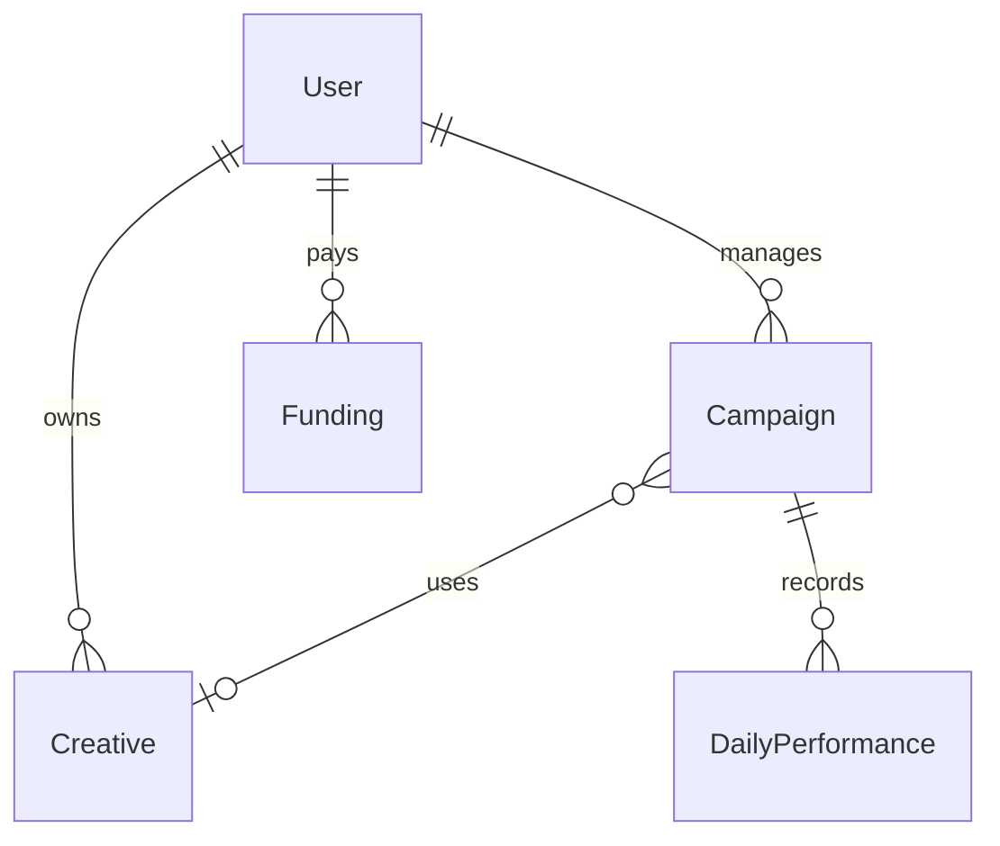

# Cuneo Ad Manager

Self-serve advertising platform where local businesses can create, fund and track their own ad campaigns. I built it in 2025 for my computer science class at ITIS Mario Delpozzo, mainly to learn Laravel end to end.

<!-- Add 2 or 3 screenshots here: dashboard, campaign creation, statistics -->

## Features

**For advertisers**
- Sign up and log in, with email verification and optional two-factor authentication (Jetstream)
- Top up the account balance with Stripe Checkout
- Upload ad images, stored on AWS S3
- Create campaigns with a budget, a max bid per click and targeting by country or city, ISP, OS, browser, browser language, device and keywords (with Google Places autocomplete for locations)
- Start, pause, edit and delete campaigns
- Daily statistics per campaign: impressions and clicks

**For visitors**
- A demo site that shows ads by category, served by the platform

## How ad matching works

When a visitor loads a page, the app first profiles them from the request: IP geolocation and ISP through IPinfo, plus OS, browser, device type and language from the user agent. That profile is saved once and reused on later requests.

To pick an ad, it then:

1. Takes the campaigns that are active and within their start and end dates
2. Keeps only those whose targeting matches the visitor on every field (country or city, ISP, OS, browser, language, keywords, device), where a field set to "all" matches everyone
3. Sorts them by max bid, highest first
4. Serves the first one whose owner still has enough balance, and counts an impression

Billing is per click: when a visitor clicks, the click is recorded, the advertiser's balance is charged the campaign's max bid, and the visitor is redirected to the target URL. A scheduled job creates the daily stats row for every campaign each day.

## Data model


```mermaid
erDiagram
    User ||--o{ Campaign : manages
    User ||--o{ Creative : owns
    User ||--o{ Funding : pays
    Campaign }o--o| Creative : uses
    Campaign ||--o{ DailyPerformance : records
```

- **User**: advertiser account, with profile, company details and balance
- **GuestUser**: anonymous visitor profile (IP, location, ISP, device, browser, language)
- **Creative**: ad image stored on S3
- **Campaign**: ad content, targeting, max bid, budget and dates
- **DailyPerformance**: impressions and clicks per campaign per day
- **Funding**: Stripe top-up with its payment status

## Tech stack

Laravel 12 (PHP 8.2), Livewire, Blade, Tailwind CSS, Jetstream and Sanctum, MySQL or PostgreSQL, Stripe, AWS S3, IPinfo, Google Places API.

## Running it locally

```bash
composer install
npm install && npm run build
cp .env.example .env
php artisan key:generate
php artisan migrate
php artisan serve
```

In another terminal, run `php artisan schedule:work` and `php artisan queue:work` for the daily stats job.

Keys to set in `.env`: database connection, `STRIPE_KEY` and `STRIPE_SECRET`, the `AWS_*` values for the bucket, `IPINFO_API_KEY` and `PLACES_API_KEY`.

## Known limitations

- Start, pause and delete are GET requests, which should become POST or DELETE with CSRF protection
- There is no admin panel
- The balance is checked when an ad is served but charged on click, so it can briefly go below zero
- Visitor profiles are matched by IP and user agent, so visitors behind the same network can be merged
